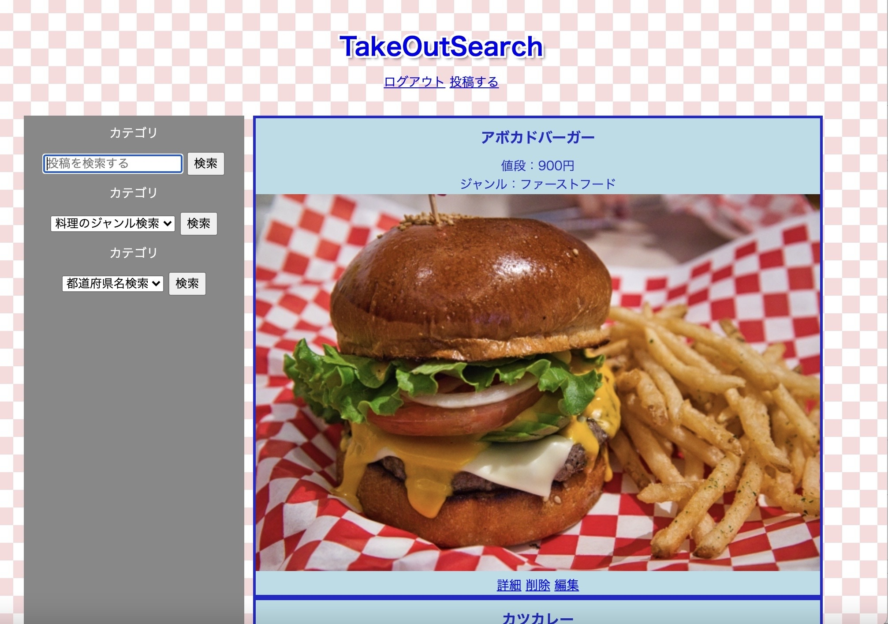
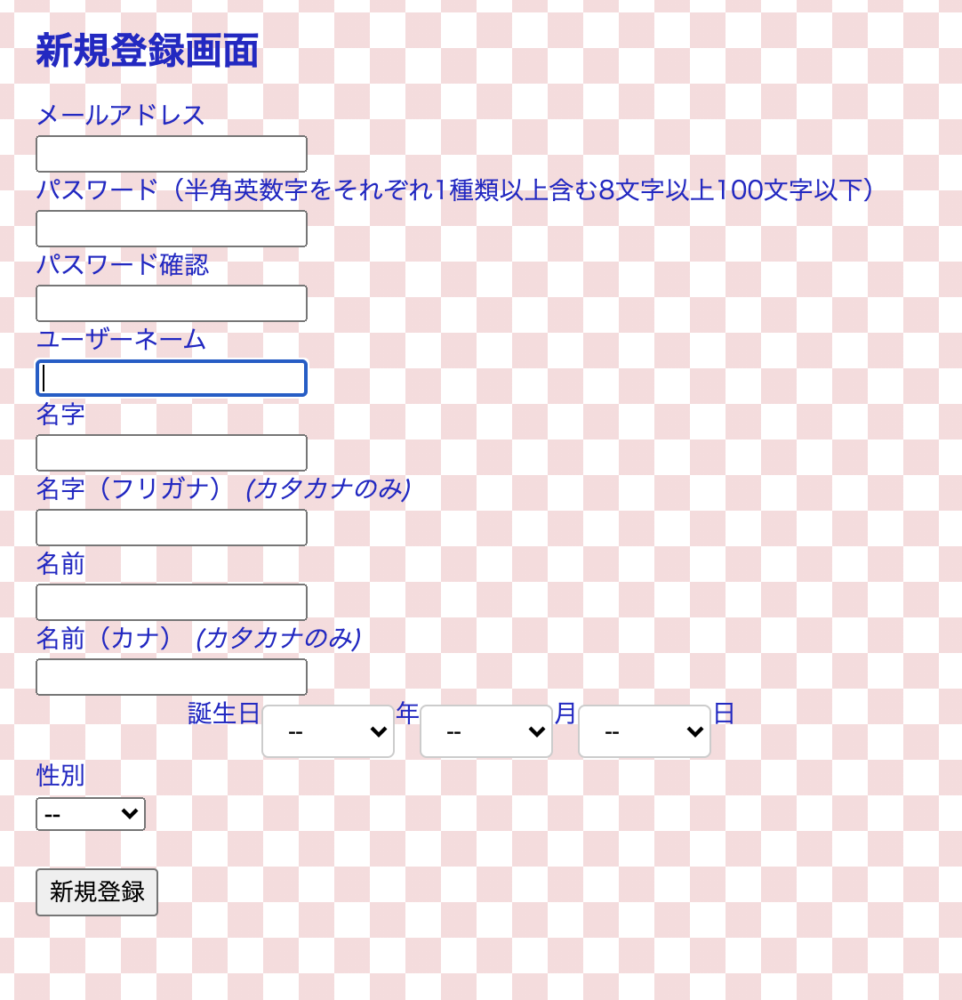
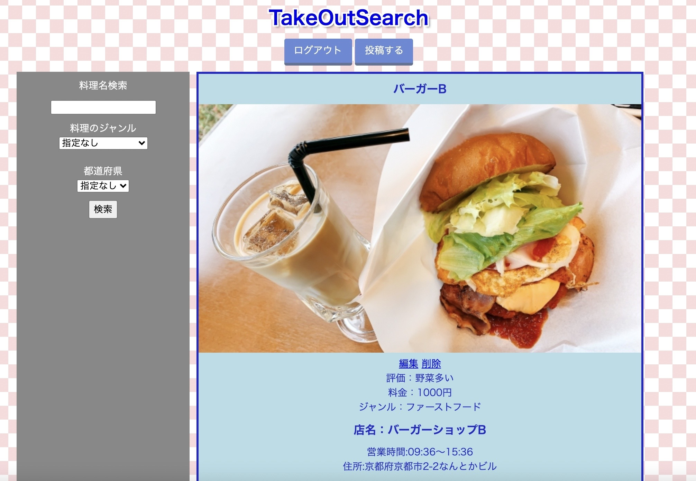
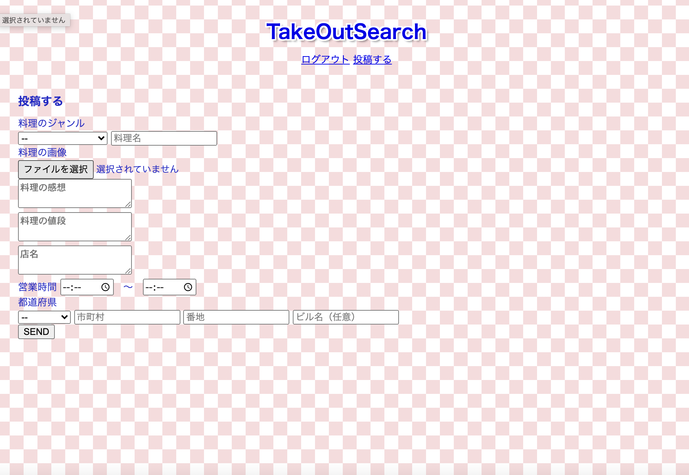
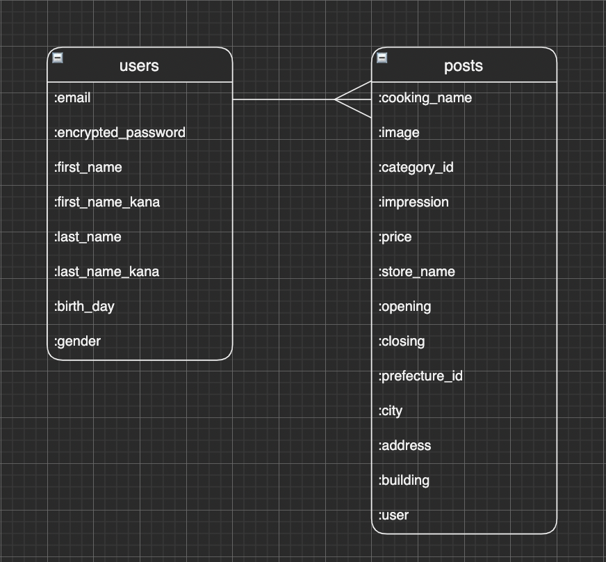

# **アプリ名**

**takeout-search**

# **概要**

**テイクアウト専用の口コミ投稿サイト**

- 口コミの閲覧・検索・絞り込み表示は未ログインで可能
- 口コミ投稿はユーザー登録・ログイン必須

# **本番環境**

 https://takeout-search.herokuapp.com/

テスト用ログインアカウント

- Eメール：test1@test
- パスワード：1111111a

# **制作背景**
昨今の世情により、外食に抵抗のある人が増えていること、それに伴って飲食店もテイクアウト・デリバリー可能または限定のお店が増えてきていることを考え、テイクアウトできる料理・お店の情報を集められたら便利だと思い作成しました。

# **アプリ機能**
##  トップページ
- 投稿一覧表示
- 検索機能
- ジャンル別・都道府県別絞り込み機能

##  ユーザー管理機能
- 新規ユーザー登録
- ログイン
- ログアウト

##  投稿詳細画面

##  新規投稿画面

# **工夫した点**
自分が使うとした場合、そして周りの人たちの意見も聞いてどのような検索・絞り込みができれば便利かを考えて作成しました。

# **今後の課題・実装したい機能**
現状の絞り込み機能は都道府県までなので、もう少し範囲を絞り込める検索機能を追加してより実用的な検索ができるようにすることが第一の課題です。また、料理・お店に対する評価機能などを実装し、評判のいい料理やお店を見つけられるような検索・ソート機能を実装したいと思っております。
#  使用技術（開発環境）　 #
- ## バックエンド ##
	Ruby、Ruby on Rails
- ## フロントエンド ##
	HTML、CSS
- ## データベース ##
	MySQL、Sequel Pro
- ## インフラ ##
	AWS(S3)
- ## アプリケーションサーバ ##
	Heroku
- ## ソース管理 ##
	GitHub、GitHubDesktop
- ## テスト ##
	RSpec
- ## エディタ ##
	VSCode

# **DB設計（ER図）**

